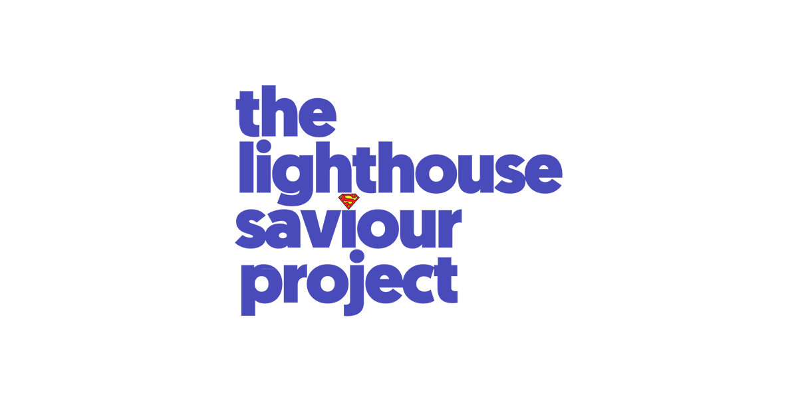

# thelighthousesaviourproject

Lighthouse shines light to guide the correct path for ships to follow and also warns of potential dangers in their path, and as Superman once said - "the world doesn’t need a saviour but every day I hear people crying for one".

 

### THE ORIGINAL IDEA

This web application is the same original demo version that operated through February to December 2018, inspired from *Plan International* and *Monash University*'s XYX Lab's work on **Free To Be**. The initial idea was to use pornography viewership data, population and crime rate statistics to identify life threatening locations and prevent crime from happening. Upon studying various statistics it could be concluded that the probability of a crime happening depends on the character of the person committing it and the environment that presents any person abundance of opportunities to commit the crime.

### INSTRUCTIONS

You all know buildings that have been abandoned, places you have heard rumours about, places where people are afraid to go to, the favourite hangout spot of your neighbourhood bully or wannabe gangster, places where people make lewd remarks as you pass by…or where you have seen people making lecherous gestures to someone else... you just have to mark those locations on the map.

This is a very minimal map, here you right click and select if you want to mark a place that is isolated/deserted or someplace where you have seen people doing illegal activities or bullying, or someplace where you have experienced or have seen some one being subjected to lewd behaviour.

isolated places are places where is crime is waiting to happen, bad people are those who may commit it, lewd behavior indicates places where some crime has already happened

# 
